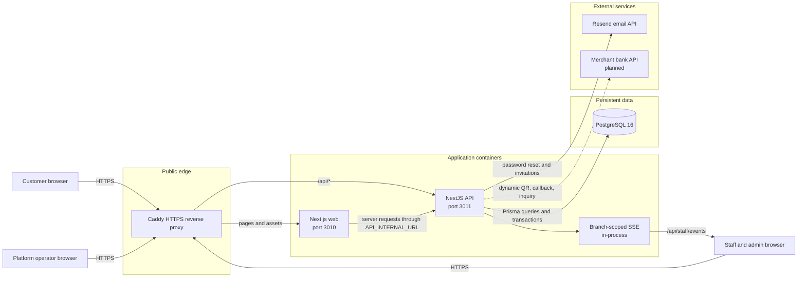
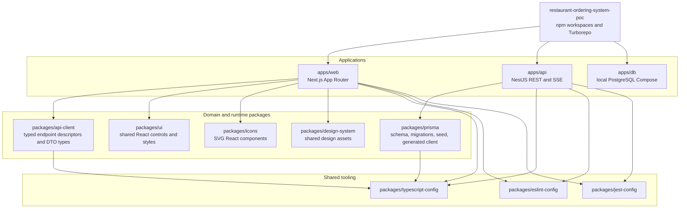
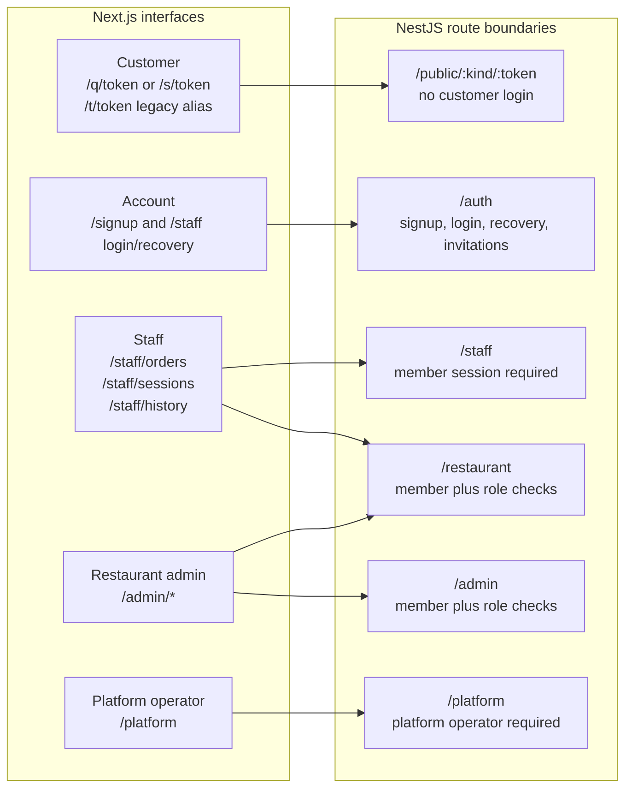
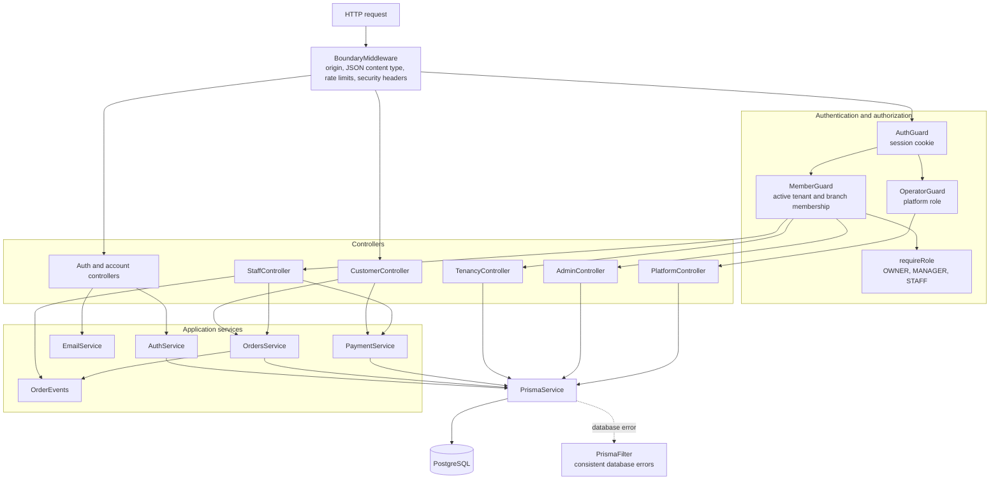
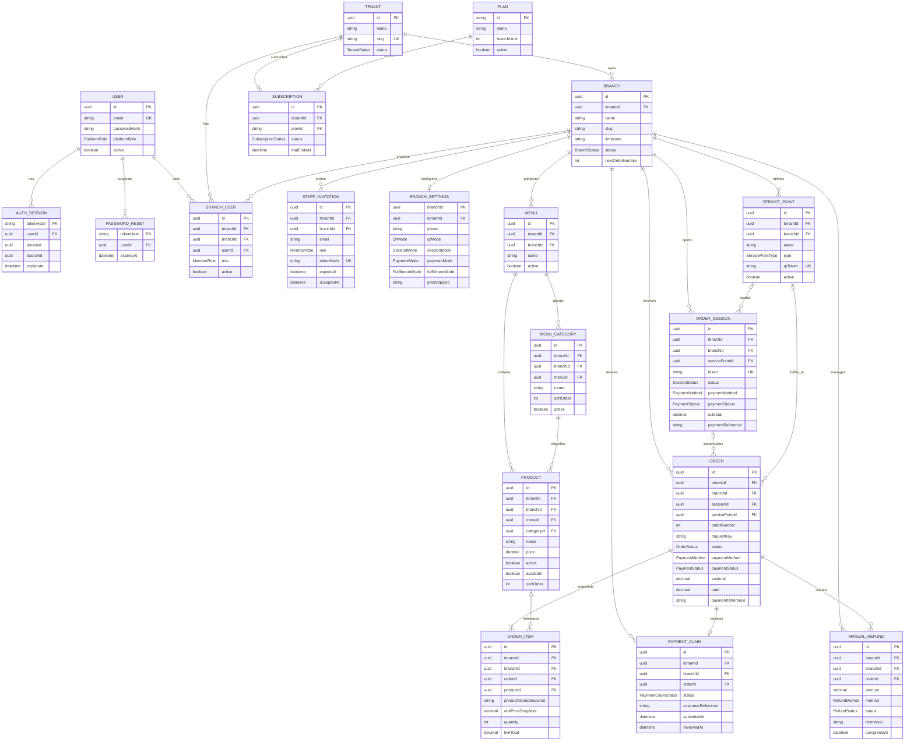
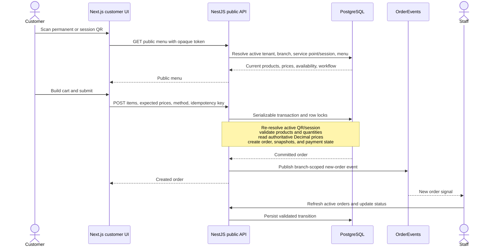
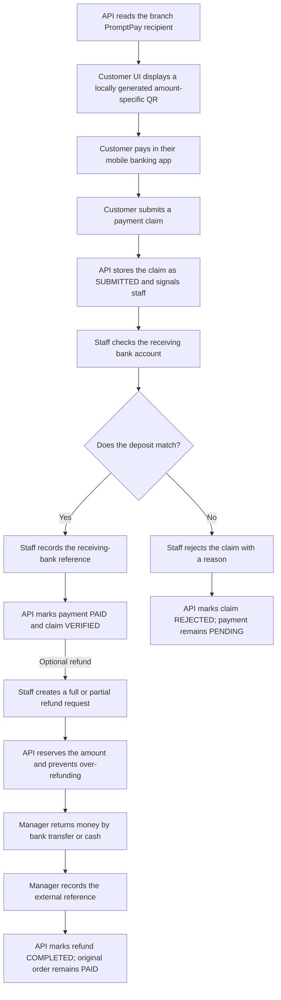
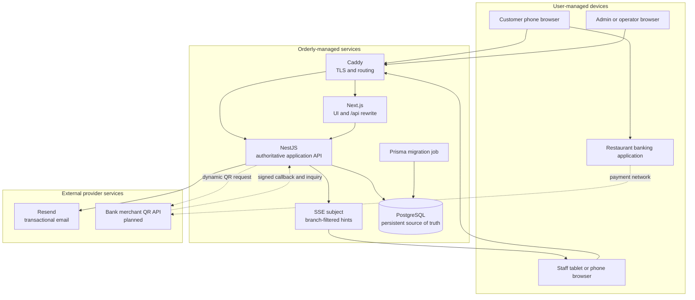
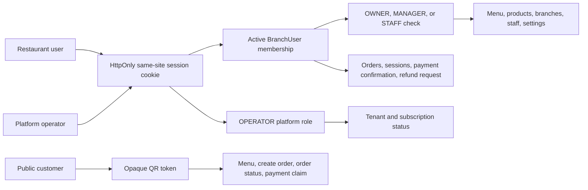
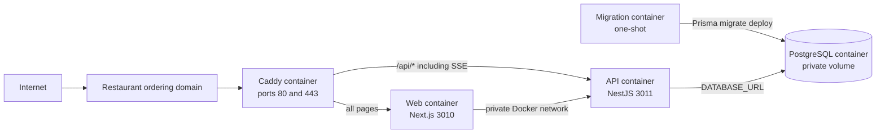

# System architecture

This document describes the current `develop` branch of Orderly, including the monorepo, runtime services, database model, security boundaries, and external integrations. Solid arrows in the diagrams are implemented. Dashed arrows and dashed boxes describe planned extension points.

## Architecture at a glance

Orderly is a TypeScript Turborepo with a Next.js App Router frontend, a NestJS API, Prisma, and PostgreSQL. Customers use public opaque QR tokens. Restaurant and platform operations use authenticated browser sessions. All business state is stored in PostgreSQL; the browser and real-time channel are never the source of truth.

In local development, the browser opens Next.js on port `3010`. Next rewrites `/api/*` to NestJS on port `3011`. In the production Compose stack, Caddy terminates HTTPS and routes pages to Next.js and `/api/*` directly to NestJS. A one-shot migration container runs Prisma migrations before the API starts.

## Monorepo structure

The main responsibilities are:

- `apps/web`: customer menu and order status pages, staff dashboard, restaurant administration, onboarding, and platform administration.
- `apps/api`: authentication, tenant and branch authorization, public ordering, management APIs, payment review, refunds, reports, and SSE.
- `apps/db`: the developer PostgreSQL container definition.
- `packages/api-client`: runtime-agnostic endpoint descriptions and shared TypeScript response/request types. The frontend owns the actual server and browser fetch implementations.
- `packages/prisma`: the authoritative relational schema, migrations, seed data, and Prisma client export.
- `packages/ui`, `packages/icons`, and `packages/design-system`: shared presentation code.
- Shared TypeScript, ESLint, and Jest packages keep application configuration aligned.

Generated `dist`, `.next`, coverage, and Turbo cache directories are build artifacts rather than architectural modules.

## Frontend routes and API boundaries

A customer QR token grants access only to its public menu and related customer order operations. It is not staff authentication. Authenticated restaurant endpoints derive tenant and branch context from the server-side session and active `BranchUser` membership; they do not trust a browser-supplied `tenantId`.

## NestJS internal structure

`OrdersService` contains the critical transactional rules: QR/session validation, current product and availability checks, server-side Decimal price calculation, historical snapshots, idempotent order creation, state transitions, payment claims, manual confirmation, and refund limits. UI components display state and initiate commands; they do not calculate authoritative totals.

## Entity relationship diagram

The diagram shows persisted models. Most business-owned rows carry both `tenantId` and `branchId`. Composite relations and scoped queries enforce ownership at the application and database layers.

Important modeling details:

- `Tenant → Branch → business records` is the ownership hierarchy. Branch-scoped foreign keys include tenant and branch identifiers so records cannot be related across tenants accidentally.
- `ServicePoint` generalizes tables, seats, zones, counters, and pickup locations.
- `OrderSession` is optional. It supports temporary QR codes and workflows that accumulate several independent orders before checkout.
- `OrderItem` stores product-name and unit-price snapshots. Historical orders therefore do not change when products are renamed or repriced. `productId` is nullable so the snapshot can survive product retirement.
- Payment state and order fulfillment state are separate. A `PREPARING` order can have a `PAID` or `PENDING` payment.
- `PaymentClaim` is a customer statement that payment was sent. It is never proof of settlement.
- `ManualRefund` records money returned outside the application. It does not rewrite the original paid order or total.
- Reviewer and actor fields such as `confirmedBy`, `reviewedBy`, and `completedBy` currently store user IDs as audit values but are not foreign-key relations. This preserves the record if a user is later deactivated.

## Customer order lifecycle

The client sends `expectedPrice` only to detect that its menu became stale. NestJS rejects mismatches and always computes totals from database prices. A unique tenant-scoped request key returns the original order for a repeated identical request and rejects reuse with a different payload.

## Current PromptPay and refund lifecycle

The current application does not contact PromptPay or a bank. QR generation uses the configured recipient ID and server-calculated amount. Uploaded or customer-entered evidence would remain unverified until staff checks the receiving account. The [payment architecture guide](PAYMENTS.md) describes the exact current implementation, manual reconciliation improvements, slip-assisted review limits, and provider-ready design.

## External and internal service structure

Current external dependencies:

- PostgreSQL is operational infrastructure and contains all critical state.
- Resend sends password-reset and staff-invitation email when `RESEND_API_KEY` and `EMAIL_FROM` are configured. Email delivery is not used for order correctness.
- Customer and restaurant banking apps perform PromptPay transfers outside Orderly.
- No object storage, Redis, message broker, payment gateway, bank API, or printer agent is currently required.

Planned direct-bank extension:

- Add a bank-provider interface for dynamic QR creation, signed callback verification, payment inquiry, and reconciliation.
- Add tenant-scoped merchant-account configuration backed by encrypted secret storage; never store live bank secrets in `BranchSettings` plaintext.
- Add a `PaymentAttempt` ledger with provider request IDs, merchant account, amount, currency, expiry, event hashes, and verified transaction references.
- Mark payment `PAID` only after the bank response matches tenant merchant, order/session reference, receiver, exact amount, currency, and a valid final status.
- Keep the current manual flow as a fallback when a branch has not completed bank onboarding or the provider is unavailable.

## Authentication and security boundaries

Security controls currently include:

- Random UUID tokens for permanent service points and temporary order sessions.
- Hashed authentication, reset, and invitation tokens; raw tokens are sent only to the intended browser/email recipient.
- HttpOnly, `SameSite=Strict` session cookies and session expiry.
- Exact-origin and JSON content-type checks for state-changing requests.
- In-process login, reset, and write rate limits for the current single-API deployment.
- Tenant and branch scoping on restaurant queries and composite foreign keys.
- Server-side product, availability, price, total, state-transition, and refund-limit validation.
- Transactional order creation and row locks for order, payment review, and refund concurrency.
- Duplicate-submission protection through tenant-scoped idempotency keys and request hashes.

## Real-time behavior

The staff dashboard first loads active orders from PostgreSQL. It then listens to `/staff/events` for `new`, `changed`, and heartbeat messages. Events contain only a branch-scoped hint; the browser invalidates its TanStack Query cache and reloads authoritative state from the API.

`OrderEvents` is currently an in-process RxJS `Subject`, so the production topology intentionally runs one API replica. A future multi-replica deployment would need a shared event transport or database-backed notification mechanism. Losing an event does not lose an order because the dashboard also polls and refreshes from PostgreSQL.

## Deployment structure

Required production properties are an HTTPS `APP_ORIGIN`, a PostgreSQL connection URL, a strong database password, and the public hostname. Resend settings are required only for recovery and invitation email. Deployment runs migrations before the API and keeps PostgreSQL off the public edge.

## Current architectural limits

The following limits are deliberate and should be considered when extending the system:

- One shared PostgreSQL database with tenant-scoped tables; no database-per-tenant model.
- One active API replica because SSE notifications and rate-limit buckets are in process.
- Manual PromptPay settlement confirmation; no automatic bank or gateway verification.
- Manual refunds record external money movement; Orderly does not initiate a transfer.
- Basic subscription representation without automatic recurring billing.
- Gross-sales reports do not yet subtract completed refund records.
- Product availability is a sold-out toggle rather than quantity or cost inventory.
- No offline-first synchronization, message broker, Redis, microservices, or native mobile application.

These boundaries keep the current product focused on QR-to-menu-to-order operations while preserving clear seams for bank payments, inventory, tax documents, and multi-replica real-time delivery later.
