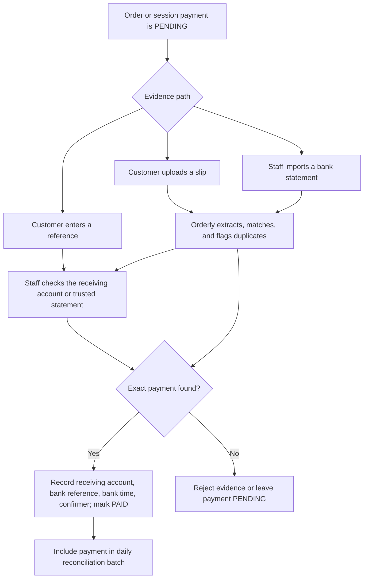
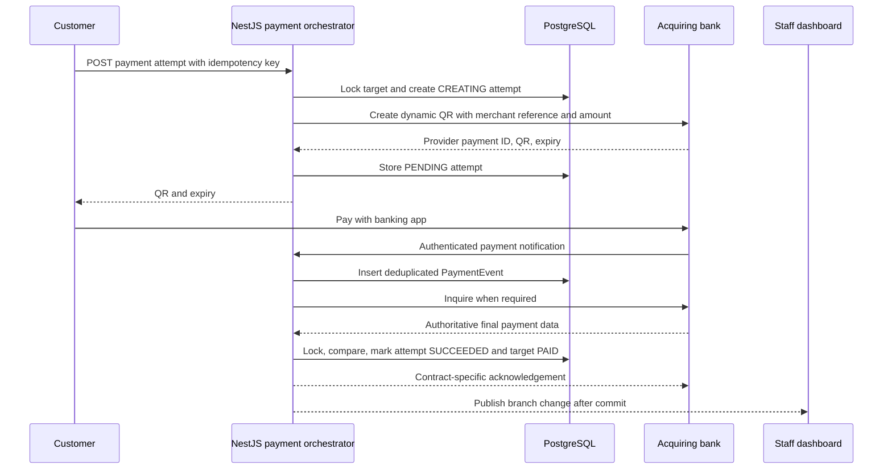
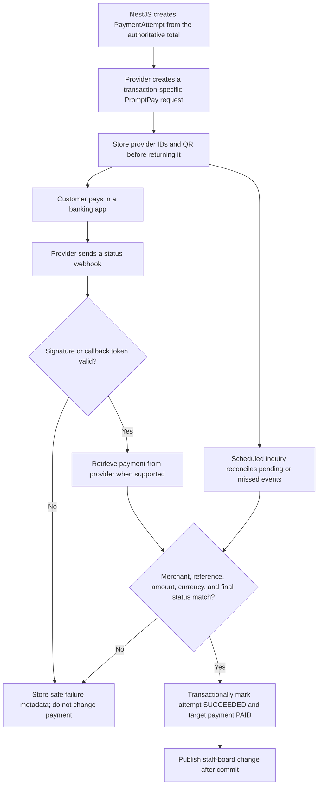

# Payment architecture and improvement paths

This guide explains how Orderly handles payment today, what the current records do and do not prove, and how to improve the workflow with or without a live payment service. It reflects the `develop` branch and official payment documentation reviewed on 25 September 2026.

The recommended product direction is:

1. Keep the current manual workflow as the dependable baseline and fallback.
2. Strengthen reference capture, duplicate detection, reconciliation, and refund reporting.
3. Add optional slip-assisted review only to reduce staff typing; never treat locally parsed evidence as settlement proof.
4. Add automatic confirmation through a tenant-scoped bank or payment-provider adapter when transaction volume justifies merchant onboarding and provider fees.

Payment state must remain separate from order fulfillment. A payment becoming `PAID` should not silently move an order from `NEW` to `ACCEPTED`, and preparing an order should not imply that money was received.

## What is implemented today

### Branch payment workflows

Each branch selects one payment workflow in `BranchSettings`:

- `PER_ORDER`: the customer chooses `CASH` or `PROMPTPAY` for every order. Each order has its own payment state.
- `AT_CHECKOUT`: orders accumulate in an open `OrderSession`. Staff closes the session, chooses `CASH` or `PROMPTPAY`, and confirms one payment against the session subtotal.
- `STAFF_MANAGED`: Orderly records and fulfills orders while payment is handled outside the customer flow.

The current methods are `CASH` and `PROMPTPAY`. Payment statuses are `PENDING`, `PAID`, `FAILED`, and `CANCELLED`, although no automatic provider currently moves a payment to `FAILED`. Order fulfillment separately uses `NEW`, `ACCEPTED`, `PREPARING`, `READY`, `COMPLETED`, and `CANCELLED`.

### Cash

For per-order cash, the order is created with `paymentMethod = CASH` and `paymentStatus = PENDING`. It appears immediately on the staff dashboard. After receiving cash, any active branch staff member can confirm it. The API records `paidAt`, the confirming user, and an optional note or reference.

For an at-checkout branch, the same behavior applies to the closed `OrderSession` rather than each child order. Session payment and individual order fulfillment remain separate.

### PromptPay

The NestJS `PaymentService` reads the branch's `promptpayId`, uses `promptpay-qr` to create a Thai QR payload containing the server-calculated amount, and renders it as SVG with `qrcode`. No bank or gateway is called.

For per-order payment:

1. The API creates the order as `PROMPTPAY / PENDING` using prices and totals calculated from PostgreSQL.
2. `GET /api/public/:kind/:token/orders/:id/promptpay` returns the amount, raw QR payload, SVG, and `manualConfirmation: true`.
3. The customer pays in a separate banking application.
4. The customer may submit a reference and note through `POST /api/public/:kind/:token/orders/:id/payment-claim`.
5. The API stores one `PaymentClaim` per order as `SUBMITTED` and signals the staff board.
6. Staff independently checks the restaurant's receiving bank account.
7. Staff confirms through `POST /api/staff/orders/:id/payment`. PromptPay confirmation requires a receiving-bank transaction reference.
8. In one transaction, the order becomes `PAID`, confirmation audit fields are stored, and any claim becomes `VERIFIED`. An unmatched claim can instead become `REJECTED` while the payment remains `PENDING`.

For `AT_CHECKOUT`, staff closes the session with PromptPay, obtains the QR through `GET /api/staff/sessions/:id/promptpay`, and confirms the closed session through `POST /api/restaurant/sessions/:id/payment`. The current customer claim feature applies to per-order payment, not session checkout.

### Refunds

Orderly does not send money. A `ManualRefund` records a refund that staff performs as cash or an external bank transfer:

- Any active branch staff member can request a full or partial refund for a paid order.
- Pending and completed refunds reserve value, so concurrent requests cannot exceed the original order total.
- An owner or manager completes or cancels a pending refund.
- Completing a bank-transfer refund requires the external transfer reference.
- The original order remains `PAID`; the refund is a separate immutable operational record.

Current summaries are gross-payment reports. They group confirmed cash and PromptPay by the time Orderly marked them paid and do not subtract completed refunds.

## What the current QR and payment claim prove

The locally generated PromptPay QR is a payment instruction. It identifies a recipient and amount in a valid Thai QR structure. It does not report whether the customer opened a bank app, approved a transfer, the receiving bank accepted it, or settlement completed.

The [Bank of Thailand Thai QR Payment Standard](https://www.bot.or.th/content/dam/bot/documents/th/our-roles/payment-systems/about-payment-systems/ThaiQRCode_Payment_Standard.pdf) separates PromptPay credit transfer using a PromptPay ID from bill-payment references and payment-innovation verification APIs. It defines fields such as the recipient identifier, THB currency, transaction amount, and CRC. The CRC detects corruption of the QR payload; it is not a signed bank receipt and cannot prove that a transfer occurred.

The current customer payment claim proves only that someone possessing the table/session URL pressed **I have paid** and supplied optional text. It does not authenticate the payer or query a financial institution. The receiving bank account remains the authoritative evidence in the manual workflow.

Common failure cases are:

- Two orders have the same amount at nearly the same time.
- A customer enters a transaction reference incorrectly.
- A screenshot or slip is edited or reused for another order.
- The transfer is sent to the wrong recipient.
- The customer begins but does not complete the banking flow.
- Staff confirms the wrong deposit or records the wrong reference.
- `paidAt` records staff confirmation time, which may differ from the bank's transfer time.

## Improvements without a live external payment service

This path keeps the platform independent of payment gateways and bank APIs. It can make manual work safer and faster, but a human or a trusted merchant-supplied bank record must remain in the confirmation loop.

### Harden manual confirmation first

Add a branch payment configuration that identifies the receiving account separately from the public PromptPay ID. Store only safe display data such as an account nickname, bank code, masked account, and expected recipient name. Do not store online-banking credentials.

When staff confirms PromptPay, record:

- receiving account ID
- bank transaction reference
- bank transaction time, if visible
- received amount
- confirmation time and confirming user
- optional discrepancy/reconciliation note

Enforce uniqueness for a non-null external reference within the same receiving account. A safer database key is `(receivingAccountId, externalReference)` rather than global reference uniqueness because reference formats differ between banks. A duplicate should block confirmation and show the order that already uses the reference.

Keep `bankPaidAt` separate from `confirmedAt`. The current `paidAt` is the time staff confirms inside Orderly; treating it as the bank transaction time makes reconciliation and day-boundary reports inaccurate.

Add a payment review queue with filters for:

- customer claim waiting for review
- pending longer than a branch threshold
- duplicate or missing reference
- amount mismatch
- payment confirmed but not reconciled
- refund pending completion

At daily close, staff should compare confirmed PromptPay totals with the receiving bank's transactions and explicitly close a reconciliation batch. Differences remain visible until resolved.

### Optional slip upload as review assistance

A customer-uploaded bank slip can reduce typing and help staff find a transfer. Without a trusted verification service or bank inquiry, it must remain **evidence**, not automatic confirmation.

A safe local pipeline would:

1. Accept JPEG, PNG, or PDF within strict size and page limits.
2. Verify the actual media type, strip metadata, create a safe derivative, and scan the upload before staff viewing.
3. Store the file outside the public web root with a random object key and short retention policy.
4. Compute a SHA-256 file hash to detect exact reuse.
5. Attempt QR decoding first and OCR second.
6. Extract candidate fields such as amount, transfer time, recipient, masked source account, and transaction reference.
7. Compare those fields with the branch receiving account, order total, and plausible time window.
8. Flag duplicate file hashes and duplicate decoded transaction references.
9. Show the extracted fields and original evidence to staff, who still verifies the receiving account and confirms or rejects the claim.

Parsing a valid QR or matching OCR text increases review confidence only. A forged image can contain internally consistent fields, and CRC validation proves only that the encoded text is structurally intact. The payment must remain `PENDING` until staff or an authoritative API confirms it.

Suggested evidence states are `UPLOADED`, `PARSED`, `NEEDS_REVIEW`, `ACCEPTED`, `REJECTED`, and `PURGED`. Store why a match was suggested and who accepted it. Do not store customer bank details longer than the operational and legal retention policy requires.

### Manual bank-statement import

A statement import can provide better batch reconciliation without a live API. The restaurant downloads a CSV or supported report from its receiving bank and uploads it from an authenticated staff page.

Implement each bank format as a narrow parser. Stage imported rows before affecting payments, hash the source file, deduplicate bank transactions by receiving account and reference, and show proposed matches using exact amount, reference, and time. Staff approves the batch or individual matches. Preserve the original import, parser version, actor, and decision log for the chosen retention period.

This is still staff-supplied evidence and should be labeled `MANUAL_IMPORT`, not `BANK_VERIFIED`. It is useful for daily close and discovering payments that customers did not claim, while avoiding the false promise of live verification.

### Manual-only target flow



## Improvements with an external payment service

Automatic confirmation requires an authoritative party that can identify the merchant transaction and report its final status. This can be a payment gateway/aggregator or a direct commercial bank/acquirer integration. Generating a standards-compliant QR locally is not that service.

### Gateway or aggregator

The API creates a transaction-specific payment request from the authoritative order or session total. The provider returns a QR and provider identifiers. After the customer pays, the provider sends a webhook; Orderly verifies the webhook and usually retrieves the payment independently before marking it paid.

Official examples currently documented for Thailand include:

- [Opn/Omise PromptPay](https://docs.omise.co/en/promptpay/thailand): create a PromptPay source and charge in THB minor units, show the charge QR, receive `charge.complete`, and retrieve the charge to verify `successful`. Its guide supports QR expiry and states that PromptPay charges cannot be voided or refunded through Omise.
- [Xendit PromptPay](https://docs.xendit.co/docs/qr-promptpay): use the PromptPay QR channel and a payment request. Its current channel page lists PromptPay refund capabilities as unavailable. Its [payment webhook documentation](https://docs.xendit.co/apidocs/payment-webhook-notification) identifies the business, merchant reference, payment request, amount, currency, and final status, and documents `x-callback-token` origin verification.

Provider capabilities, limits, pricing, settlement timing, refund support, and platform/sub-account terms can change. Confirm them during merchant onboarding rather than encoding them as permanent product assumptions.

### Direct bank or acquirer integration

A restaurant may contract directly with its acquiring bank for merchant QR creation, payment notification, transaction inquiry, settlement reporting, and sometimes same-day void/refund operations. “Direct” means Orderly calls the bank's contracted merchant API instead of a gateway. It does not mean reading a personal bank account, scraping online banking, automating a mobile app, or deriving confirmation from the QR payload.

This route gives strong transaction identity and direct settlement to the merchant, but it has a much higher onboarding and operational cost than locally generated PromptPay QR. It is usually appropriate when a tenant is a Thai legal entity with enough volume and technical support, or when Orderly has a bank-approved management-system-provider/platform agreement.

#### What Thai banks currently expose

The exact product and contract must be selected before implementation because each bank has different identifiers, signatures, callback behavior, settlement files, limits, and refund windows.

- [KBank QR API](https://www.kasikornbank.com/th/business/sme/financial-services/pages/qr-api.aspx) documents server-created dynamic Thai QR with a ten-minute lifetime, payment notification callbacks, payment inquiry, void, and settlement. Its direct API onboarding is limited to legal entities and includes portal testing, pre-screening, UAT, bank contact, and production connection approval. The current [merchant application](https://www.kasikornbank.com/th/business/sme/financial-services/collection-solutions/Documents/EDC_ApplicationForm_EN.pdf) asks for transmission and callback IP addresses, a callback URL, and a client certificate; commercial fees and limits remain subject to the merchant agreement.
- [Bangkok Bank QR Payment](https://apiportal.bangkokbank.com/en/api/qr-payment) is also corporate-only and requires testing, connection-information exchange, a service agreement, and a public certificate. Its [published API specification](https://apiportal.bangkokbank.com/en/api/qr-payment/api-documents) describes OAuth 2.0 client credentials, request-specific RS256 JWT signatures, unique request references, QR generation, authenticated payment notification, payment inquiry, and settlement-related flows. The bank states that failed notifications are retried up to three times, so Orderly must still perform inquiry and reconciliation.
- [SCB Payment Gateway and Dynamic QR API](https://www.scb.co.th/th/sme-banking/payment-solution/payment-solution-products/scb-payment-gateway) advertises Thai QR dynamic generation and bank settlement for registered merchants. Detailed production credentials, callbacks, status codes, reports, and certification are supplied through merchant onboarding and must be treated as contract-specific.

KBank also distinguishes a merchant connecting directly from one connecting through a management-system provider. That distinction matters for this SaaS: restaurant-owned bank contracts and a platform collection model are legally and operationally different. Do not route many tenants through one merchant account unless the acquiring bank has explicitly approved Orderly for that fund flow.

#### Decide the merchant model first

Use one of these models and record the decision before writing an adapter:

1. **Tenant-owned merchant account:** each restaurant signs with the bank, owns the settlement account, and supplies credentials or a credential grant for its branch. Orderly acts as its software processor. This provides the clearest isolation and settlement trail, but onboarding every tenant is slower.
2. **Bank-approved platform or management-system-provider model:** Orderly contracts with the bank to onboard and identify sub-merchants. The bank contract must specify merchant identity, settlement, refunds, support, KYC/CDD responsibilities, and permitted credential/token handling. A normal single-merchant agreement is not enough.
3. **Gateway/acquirer account:** a licensed provider handles merchant onboarding and exposes a common API. This is often the practical first automatic-payment integration even though an additional intermediary and fee are involved.

For the first production release, prefer tenant-owned merchant accounts unless a bank has already approved the platform model. The frontend must never select a merchant by sending `tenantId`, `merchantId`, or `billerId`; the API resolves the account from the QR destination's tenant and branch.

#### Recommended product choice for Orderly

Direct-bank integration should be an optional advanced payment connection, not the default self-setup path. The documented corporate eligibility, commercial onboarding, infrastructure information, UAT, and certificate exchange conflict with the product goal that a small stall or café can register and begin using Orderly without support.

Keep locally generated PromptPay plus manual confirmation as the universal baseline. For automatic confirmation, evaluate a gateway with supported merchant/sub-merchant onboarding first. Offer a direct-bank adapter to larger tenants that already have a compatible merchant contract, or after Orderly signs an approved platform/management-system-provider agreement.

If a direct adapter is commissioned, Bangkok Bank is a practical technical reference because its public specification exposes the complete create-notify-inquire pattern and detailed authentication requirements. This is not a commercial recommendation: choose the first production bank from signed pricing, onboarding fit, settlement/refund capability, support, and sandbox access. Do not implement a production adapter from public documentation alone.

#### Information to obtain from the bank

The public documentation is not the complete production contract. Obtain and version the following before implementation:

- sandbox and production base URLs
- merchant, biller, terminal, store, and branch identifiers and their uniqueness rules
- QR-create, QR-cancel, payment-inquiry, refund/void, and settlement-report specifications
- OAuth/client-secret, mTLS, JWT/signature, encryption, and callback-authentication requirements
- the exact signed bytes or canonical JSON rules, accepted clock skew, nonce/request-reference rules, and key-rotation procedure
- callback source controls, retry schedule, timeout, required acknowledgement body, and event ordering guarantees
- status and error-code mapping, including whether an HTTP 200 can carry a business failure
- QR expiry, late-payment behavior, inquiry retention, void/refund cutoff, partial-refund support, and cross-bank behavior
- settlement timing, fee/tax fields, report transport such as API or SFTP, and reconciliation identifiers
- sandbox test cases, certification evidence, go-live checklist, production support contacts, and incident escalation
- static outbound IP, inbound allowlist, DNS/TLS certificate, and client-certificate requirements

Do not copy sandbox sample credentials or sample signing code into production. Store the signed contract version and provider-spec version with the adapter runbook so a bank change can be assessed against the deployed code.

#### Provider boundary in NestJS

Replace the current QR-only `PaymentService` with an orchestrator and small provider adapters. Provider DTOs and bank status codes stay inside each adapter; the ordering domain sees normalized results.

```ts
type CreatePromptPayRequest = {
  accountId: string;
  merchantReference: string;
  amount: string; // exact THB decimal from Prisma; never a JS-calculated total
  currency: 'THB';
  expiresAt: Date;
};

type ProviderPayment = {
  providerPaymentId: string;
  providerReference?: string;
  status: 'PENDING' | 'SUCCEEDED' | 'FAILED' | 'EXPIRED' | 'CANCELLED';
  amount: string;
  currency: 'THB';
  qrPayload?: string;
  expiresAt?: Date;
  paidAt?: Date;
};

interface PromptPayProvider {
  createPayment(input: CreatePromptPayRequest): Promise<ProviderPayment>;
  inquirePayment(input: {
    accountId: string;
    merchantReference: string;
    providerPaymentId?: string;
  }): Promise<ProviderPayment>;
  authenticateWebhook(input: {
    headers: Record<string, string | string[] | undefined>;
    rawBody: Buffer;
    account: MerchantPaymentAccount;
  }): Promise<AuthenticatedProviderEvent>;
  cancelQr?(input: ProviderPaymentIdentity): Promise<ProviderPayment>;
  createRefund?(input: ProviderRefundRequest): Promise<ProviderRefundResult>;
  inquireRefund?(input: ProviderRefundIdentity): Promise<ProviderRefundResult>;
}
```

Suggested API module layout:

```text
apps/api/src/payments/
  payments.module.ts
  payment-orchestrator.service.ts
  payment-state.service.ts
  payment-reconciliation.service.ts
  provider-registry.ts
  webhooks.controller.ts
  providers/
    provider.ts
    bangkok-bank.adapter.ts
    kbank.adapter.ts
```

Implement one adapter first. Do not add empty adapters for banks that have not supplied sandbox access and a merchant contract.

#### Database changes

Keep `Order.paymentStatus` and `OrderSession.paymentStatus` as fast operational summaries. Add durable evidence rather than replacing those fields immediately:

- `MerchantPaymentAccount`: tenant, branch, provider, environment, onboarding state, safe merchant/biller/terminal identifiers, masked settlement destination, and secret-manager references. Add a composite foreign key to the owning branch and a tenant/branch/active index.
- `PaymentAttempt`: tenant, branch, merchant account, exactly one order or session target, internal merchant reference, provider payment/QR identifiers, authoritative amount and currency, status, QR payload or bank response needed to display it, expiry, provider-paid time, last inquiry time, and failure code.
- `PaymentEvent`: account and attempt scope, provider event ID or deterministic hash, event type, received time, signature/authentication result, processing state, payload hash, safe error details, and optional protected raw payload.
- `RefundAttempt`: original payment attempt, requested amount, internal idempotency key, provider refund ID/reference, status, request/response timestamps, failure code, and actor.
- `SettlementBatch` and `SettlementLine`: provider report identity, period, gross, fee, net, settlement date, provider transaction reference, matched attempt/refund, and reconciliation state.

Use database constraints in the SQL migration where Prisma cannot express them:

- exactly one of `orderId` or `sessionId` is non-null
- amount is greater than zero and currency is `THB` for the first adapter
- `(merchantPaymentAccountId, merchantReference)` is unique
- provider payment IDs and event IDs are unique within the merchant account and environment
- refund totals cannot exceed the captured payment; enforce this under a locked payment row in the service as well as with transactional checks

Continue storing order totals as Prisma `Decimal`. Convert to the bank's required representation once inside the adapter, using decimal/string or integer satang according to that bank's specification. Never pass a total through JavaScript floating-point arithmetic.

#### Payment-attempt creation

Creating a bank QR is a side effect, so introduce a `POST` endpoint instead of extending the current `GET .../promptpay` behavior:

- per order: `POST /api/public/:kind/:token/orders/:id/payment-attempts`
- closed session checkout: `POST /api/staff/sessions/:id/payment-attempts`
- customer order polling remains `GET /api/public/:kind/:token/orders/:id`

The request carries a client idempotency key, not an amount or merchant account. The server loads the tenant-scoped order/session, verifies it is `PROMPTPAY / PENDING`, reads its authoritative total, and resolves the active branch merchant account.

Do not hold a database transaction open while calling the bank:

1. In a short transaction, lock the target payment, return an existing usable attempt for the same idempotency key, or create `PaymentAttempt(CREATING)` with a unique merchant reference.
2. Commit, then call `provider.createPayment` with the stored reference and authoritative amount.
3. In a second transaction, store the provider ID, QR payload, expiry, and normalized `PENDING` state.
4. If the call returns a definite rejection, mark the attempt `FAILED` with a safe code.
5. If the call times out after transmission, leave the attempt in an uncertain state and inquire by the same merchant reference. Do not generate another reference until inquiry proves the first request did not create a payment.

Allow only one active, unexpired attempt for a target unless the old QR is cancelled or expired. If a replacement is needed, cancel the earlier QR when the provider supports it and keep both attempts for audit. A late success for an older attempt must still be reconciled; never discard it because the customer is viewing a newer QR.

#### Webhook and callback implementation

The current `BoundaryMiddleware` rejects every non-browser write without the application's `Origin`, so a bank callback would receive `403`. Refactor it before enabling a webhook:

- apply browser origin/content-type checks to browser routes
- exempt only the exact `/webhooks/payments/:provider/:accountToken` routes from browser-origin checks
- give webhooks their own body limit, rate limit, content-type validation, authentication, and logging policy
- enable Nest's raw request body support with `NestFactory.create(AppModule, { rawBody: true })` when the bank signature covers raw bytes
- never log authorization headers, private identifiers, full payloads, or secrets

Use a random account-routing token in the callback URL where the bank supports per-account URLs. Treat it only as a routing hint. Authenticate with the bank's required Basic credential, signature/JWT, mTLS certificate, or documented combination, then match the authenticated merchant/biller identity to `MerchantPaymentAccount`. Source-IP allowlisting can be an additional control but must not replace cryptographic or contracted callback authentication.

Callback processing should be idempotent and durable:

1. Reject oversized or malformed requests before parsing business fields.
2. Identify a candidate account from the route token, then authenticate exactly as the provider contract requires.
3. Calculate a payload hash and derive the provider event identifier.
4. Insert `PaymentEvent` under a unique constraint before acknowledging it; a duplicate returns the same successful acknowledgement without repeating state changes.
5. Resolve the attempt by the stored merchant/provider reference under the same merchant account. Never trust a callback-supplied tenant ID.
6. When supported, call payment inquiry and use that authenticated response as the final status source.
7. Compare merchant/biller/terminal, internal reference, provider payment ID, exact amount, currency, and final status.
8. In one database transaction, lock the attempt and order/session, apply a legal transition, set the attempt `SUCCEEDED`, project `PAID`, `paidAt`, and provider reference onto the target, and mark the event processed.
9. Commit before publishing the branch SSE change.
10. Quarantine mismatches or unknown references for operator review; acknowledge only according to the bank retry contract.

The callback controller should remain thin. Signature/authentication belongs in the adapter; normalized transition and tenant checks belong in `PaymentStateService`.

#### Direct-bank sequence



#### Inquiry, expiry, and reconciliation

A webhook is a fast signal, not the accounting record. Add a durable command such as `npm run payments:reconcile` and run it every one to five minutes for pending attempts, plus a daily settlement pass. In the current single-API deployment this can be a separate scheduled process or platform cron invoking a Nest application command; use a PostgreSQL advisory lock so two runs do not process the same batch.

The pending pass should claim bounded rows with `FOR UPDATE SKIP LOCKED`, inquire attempts whose callback is late, expire only when the bank's status and expiry rules permit it, and back off after transient errors. Use database time and store the next inquiry time rather than scanning every historical attempt.

The daily pass imports or retrieves the bank settlement report and matches by merchant account plus provider reference. Record gross, fee, net, refund/void, and settlement date separately. A payment can be provider-verified but not yet settled, so expose both states. Alerts should cover:

- authenticated success callback with no matching attempt
- amount, currency, or merchant mismatch
- callback/inquiry disagreement
- a pending attempt beyond QR expiry plus tolerance
- paid attempt missing from the expected settlement batch
- settlement line without a known payment
- duplicate provider reference or event ID
- credential expiry, signature failures, and sustained inquiry failure

Do not change a confirmed payment back to pending because a later callback is older or ambiguous. Store the event, flag it, and resolve it through inquiry and reconciliation.

#### Direct-bank refunds and voids

Treat QR cancellation, payment void, and post-settlement refund as different operations:

- **Cancel QR:** prevents or discourages future payment against an unused QR. It does not return money.
- **Void/reversal:** reverses a completed transaction inside a provider-defined same-day settlement window.
- **Refund:** sends money back after payment, potentially through a separate API and settlement cycle.

The public [Bangkok Bank specification](https://apiportal.bangkokbank.com/en/api/qr-payment/api-documents) describes refund verification, refund advice, and refund reversal, with the documented flow requiring action before 23:00 on the payment day. KBank publicly lists void as a QR API capability. Availability, partial amounts, cutoff, retry rules, and cross-bank behavior must come from the signed merchant contract.

Implement `RefundAttempt` as a separate state machine such as `REQUESTED`, `SUBMITTING`, `PENDING`, `SUCCEEDED`, `FAILED`, `REVERSED`, and `CANCELLED`. Lock the captured payment and reserve the amount before calling the bank. For a timeout, inquire or follow the bank's reversal procedure; never create a second refund blindly. Mark the existing `ManualRefund` completed only after a provider refund has a final successful result, or keep provider refunds as their own records and include both sources in net-sales reporting.

After the bank's API cutoff or when the channel does not support refunds, use the existing manual bank-transfer/cash process. The UI should identify `PROVIDER_VOID`, `PROVIDER_REFUND`, and `MANUAL_REFUND` so staff and reports do not imply that Orderly moved money when it did not.

#### Credential and network setup

Use separate sandbox and production accounts. Keep client secrets and private keys in a deployment secret manager, and store only secret references and safe identifiers in PostgreSQL. Generate private keys in the target secret system or import them once through a controlled process; restrict access to the payment adapter runtime. Track certificate/key expiry and rehearse overlapping rotation before go-live.

If the bank requires source-IP allowlisting, deploy outbound traffic through a stable egress IP. If it requires mTLS, configure a dedicated HTTP client/agent with the tenant account's certificate and key; do not globally attach one tenant's certificate to all provider requests. Terminate public TLS for callbacks with a normal trusted certificate unless the bank contract specifies mTLS at ingress. Keep callback URLs stable and HTTPS-only.

Timeouts should be shorter than the browser request timeout, with bounded retries only for operations the bank defines as idempotent. Log internal attempt ID, merchant reference, provider request ID, latency, normalized result, and safe error code. Redact account IDs where required and never log secrets, access tokens, complete JWTs, QR payloads containing merchant references, or raw bank responses by default.

#### Concrete repository implementation sequence

1. **Select and onboard one bank.** Obtain sandbox credentials, merchant identifiers, certificates, callback requirements, status map, settlement format, refund rules, and UAT cases. Decide tenant-owned versus approved platform accounts.
2. **Add the domain migration.** Create `MerchantPaymentAccount`, `PaymentAttempt`, `PaymentEvent`, `RefundAttempt`, and settlement records with composite tenant/branch keys and SQL constraints.
3. **Add the provider module.** Introduce the normalized interface, registry, orchestrator, state service, and one bank adapter. Keep the existing locally generated manual PromptPay path available.
4. **Create payment attempts.** Add idempotent `POST` endpoints, two-phase bank creation, QR expiry display, refresh behavior, and late-payment handling.
5. **Accept callbacks safely.** Refactor `BoundaryMiddleware`, enable raw body, implement exact provider authentication, persist/deduplicate events, inquire, validate, and transactionally update payment state.
6. **Add reconciliation.** Run pending inquiry and daily settlement import under advisory locks, with operator review for mismatches.
7. **Add provider refunds only if contracted.** Implement the bank's precise verification/advice/reversal or refund flow; retain manual fallback.
8. **Certify and roll out.** Pass bank UAT, deploy production credentials, run low-value same-bank and cross-bank payments, test missed callbacks and timeouts, reconcile settlement, and enable one tenant/branch behind a feature flag.

Tests must include cross-tenant merchant IDs, duplicate create requests, timeout after bank acceptance, duplicate and out-of-order callbacks, invalid signatures, callback for the wrong merchant, exact-amount mismatch, old-QR late payment, concurrent callback/inquiry, QR expiry, missed callback recovery, settlement mismatch, refund timeout, refund double submission, and credential rotation.

The likely code changes are concentrated in `apps/api/src/payments`, `apps/api/src/main.ts`, `apps/api/src/security/boundary.ts`, `packages/prisma/prisma/schema.prisma`, a new Prisma migration, `packages/api-client`, and the customer/staff payment components. No WebSocket, Redis, microservice, or general event bus is required for the first adapter.

### Slip-verification API

A slip-verification provider can be an intermediate step only if it checks the transaction against an authoritative network or bank source. An API that merely runs OCR or decodes the image is equivalent to the local assisted-review path and must not mark a payment paid.

Before selecting such a service, confirm in writing:

- where its verification result comes from
- whether it verifies receiver, exact amount, bank transaction ID, and transaction time
- how duplicate/reused slips are detected
- webhook or inquiry authentication
- uptime, rate limits, retention, and deletion behavior
- Thai privacy/data-processing terms
- multi-tenant merchant onboarding and production support

Even with slip verification, transaction-specific dynamic QR plus provider webhook is usually simpler to reconcile because the payment request exists before money moves.

## Provider-ready domain design

Do not overload `Order.paymentReference` with the full provider lifecycle. Add payment records that preserve attempts, events, and reconciliation independently of fulfillment.

Suggested `MerchantPaymentAccount` fields:

- `id`, `tenantId`, `branchId`
- provider and environment
- safe account label, provider merchant ID, and masked settlement destination
- encrypted credential reference, never a plaintext secret in `BranchSettings`
- active state and onboarding status

Suggested `PaymentAttempt` fields:

- `id`, `tenantId`, `branchId`
- exactly one order or checkout session target
- method, provider, merchant account, currency, and amount in minor units
- internal idempotency key and merchant reference
- provider request/payment IDs with tenant-scoped unique constraints
- `CREATING`, `PENDING`, `SUCCEEDED`, `FAILED`, `EXPIRED`, or `CANCELLED`
- QR payload/image reference and expiry
- provider-paid time, failure code, created and updated timestamps

Suggested `PaymentEvent` fields:

- provider event ID or deterministic event hash
- payment attempt ID and tenant scope
- event type, received time, signature result, processing result, and payload hash
- encrypted or access-controlled raw payload only when operationally necessary

Suggested reconciliation records:

- receiving/settlement account
- settlement or statement period
- provider/bank transaction reference
- gross amount, fee, net amount, currency, and settlement date
- matched payment attempt and reconciliation state

Keep `PaymentClaim` and `ManualRefund` for branches using the manual path. A provider-enabled branch should also retain a manual fallback, but the UI must display whether a payment was `MANUAL_CONFIRMED`, `STATEMENT_MATCHED`, or `PROVIDER_VERIFIED`.

## Automatic confirmation flow



The webhook route must preserve the raw request body when the signature algorithm requires it. Exempt only the exact provider webhook path from browser-origin and JSON protections that do not apply to server callbacks. Keep rate limits, body limits, provider authentication, event deduplication, and tenant lookup in place.

Return a fast success response only after the event is durably recorded. Process retries idempotently. Webhook delivery is a hint, not the sole source of truth: scheduled inquiry/reconciliation must recover delayed, duplicated, out-of-order, or missed events. Opn's [webhook guidance](https://docs.omise.co/api-webhooks/thailand) explicitly recommends signature verification or independent resource verification and notes that failed webhook delivery is not guaranteed to retry.

## Multi-tenant merchant-account decision

Before coding a provider adapter, choose the funds model.

With restaurant-owned provider accounts, each tenant completes its own merchant onboarding and money settles directly to that restaurant. Orderly stores an encrypted credential reference for each merchant account and routes requests/webhooks by the provider merchant identifier. This usually gives the cleanest tenant and settlement boundary but creates more onboarding work.

With a platform account and provider-approved sub-merchants, the SaaS may control onboarding and settlement. This can simplify the restaurant experience but materially changes legal, compliance, fund-flow, dispute, accounting, and operational responsibility. It should be used only under a provider contract that explicitly supports marketplace/platform collection in Thailand.

Never send one restaurant's money through another restaurant's credentials, infer tenant identity from a frontend `tenantId`, or choose tenant context only from an unverified webhook field.

## Refund evolution

The current manual refund record should remain available because the documented Opn and Xendit PromptPay channels do not currently expose PromptPay API refunds.

Improve the manual path by:

- separating `requested`, `approved`, `sent`, `completed`, `failed`, and `cancelled` when operational volume needs those distinctions
- requiring a second approver above a configurable amount
- enforcing receiving-account/reference uniqueness for bank transfers
- recording bank transfer time separately from completion time
- adding net sales and outstanding-refund reports
- retaining the original paid amount and an append-only audit trail

If a selected provider and payment channel later supports refunds, create a provider `RefundAttempt` with its own idempotency key, provider refund ID, amount, state, events, and reconciliation. Do not mark it completed when the request is merely accepted. Wait for the provider's final status or settlement evidence, and fall back to the manual workflow when the channel does not support refunds.

## Recommended delivery sequence

### Phase 1: improve the existing manual system

1. Add receiving payment accounts with safe display fields.
2. Require and deduplicate PromptPay receiving-bank references.
3. Separate bank transaction time from staff confirmation time.
4. Add pending-payment and daily reconciliation views.
5. Report gross payments, completed refunds, and net receipts separately.
6. Add role/amount rules for confirmation and refunds.
7. Test concurrent confirmation, duplicate references, day boundaries, refunds, and tenant isolation.

This phase provides the largest reliability gain without payment-provider dependency.

### Phase 2: add optional evidence assistance

1. Add private evidence storage, retention, and deletion.
2. Parse slip QR/OCR fields and detect duplicates.
3. Keep staff confirmation mandatory.
4. Add optional bank-statement import and reconciliation batches.
5. Measure review time and mismatch rates before expanding the feature.

### Phase 3: add one provider adapter

1. Choose merchant-owned accounts or a provider-supported platform model.
2. Implement `MerchantPaymentAccount`, `PaymentAttempt`, and `PaymentEvent`.
3. Create expiring transaction-specific QR requests server-side.
4. Implement authenticated, idempotent webhooks and provider inquiry.
5. Reconcile pending attempts and settlements.
6. Roll out to one internal/test tenant, then one real merchant with low-value transactions.
7. Preserve the manual workflow as an explicit fallback.

Do not implement multiple providers until the first adapter's domain boundary, onboarding, support process, and reconciliation have worked in production.

## Production acceptance checks

For every payment path, verify:

- tenant and branch isolation for attempts, evidence, callbacks, and reports
- authoritative server-side amount and currency
- duplicate request and duplicate external-reference handling
- exact receiving merchant/account matching
- valid state transitions under concurrency
- safe retry after timeout or process restart
- delayed, duplicated, missing, and out-of-order webhook recovery
- expiry behavior and late payments
- customer and staff UI after refresh/reconnection
- gross, refund, fee, settlement, and net reconciliation
- credential rotation and test/live environment separation
- audit records for every manual and automatic decision

## Official references

- [Bank of Thailand: PromptPay overview](https://www.bot.or.th/en/financial-innovation/digital-finance/digital-payment/promptpay.html)
- [Bank of Thailand: Thai QR Payment Standard](https://www.bot.or.th/content/dam/bot/documents/th/our-roles/payment-systems/about-payment-systems/ThaiQRCode_Payment_Standard.pdf)
- [KBank: QR API product and onboarding](https://www.kasikornbank.com/th/business/sme/financial-services/pages/qr-api.aspx)
- [KBank: merchant service application and technical connection fields](https://www.kasikornbank.com/th/business/sme/financial-services/collection-solutions/Documents/EDC_ApplicationForm_EN.pdf)
- [Bangkok Bank: QR Payment overview](https://apiportal.bangkokbank.com/en/api/qr-payment)
- [Bangkok Bank: QR Payment API specification](https://apiportal.bangkokbank.com/en/api/qr-payment/api-documents)
- [SCB: Payment Gateway and Dynamic QR API](https://www.scb.co.th/th/sme-banking/payment-solution/payment-solution-products/scb-payment-gateway)
- [Opn/Omise: PromptPay](https://docs.omise.co/en/promptpay/thailand)
- [Opn/Omise: webhooks](https://docs.omise.co/api-webhooks/thailand)
- [Xendit: PromptPay channel](https://docs.xendit.co/docs/qr-promptpay)
- [Xendit: payment webhook notification](https://docs.xendit.co/apidocs/payment-webhook-notification)
- [NestJS: raw request body](https://docs.nestjs.com/faq/raw-body)
