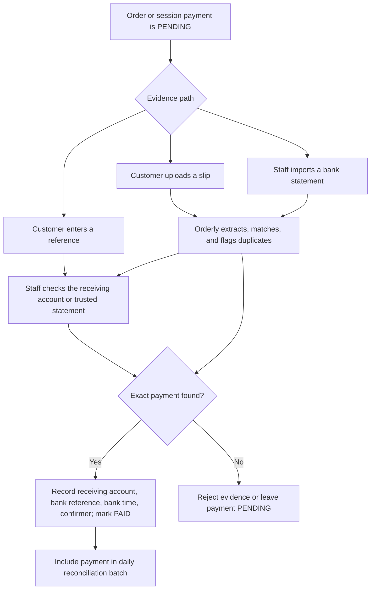
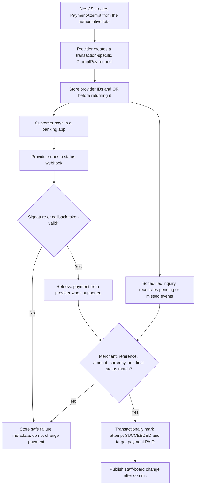

# Payment architecture and improvement paths

This guide explains how Orderly handles payment today, what the current records do and do not prove, and how to improve the workflow with or without a live payment service. It reflects the `develop` branch and official payment documentation reviewed on 25 September 2026.

The recommended product direction is:

1. Keep the current manual workflow as the dependable baseline and fallback.
2. Strengthen reference capture, duplicate detection, reconciliation, and refund reporting.
3. Add optional slip-assisted review only to reduce staff typing; never treat locally parsed evidence as settlement proof.
4. Add automatic confirmation through a tenant-scoped bank or payment-provider adapter when transaction volume justifies merchant onboarding and provider fees.

Payment state must remain separate from order fulfillment. A payment becoming `PAID` should not silently move an order from `NEW` to `ACCEPTED`, and preparing an order should not imply that money was received.

## What is implemented today

### Branch payment workflows

Each branch selects one payment workflow in `BranchSettings`:

- `PER_ORDER`: the customer chooses `CASH` or `PROMPTPAY` for every order. Each order has its own payment state.
- `AT_CHECKOUT`: orders accumulate in an open `OrderSession`. Staff closes the session, chooses `CASH` or `PROMPTPAY`, and confirms one payment against the session subtotal.
- `STAFF_MANAGED`: Orderly records and fulfills orders while payment is handled outside the customer flow.

The current methods are `CASH` and `PROMPTPAY`. Payment statuses are `PENDING`, `PAID`, `FAILED`, and `CANCELLED`, although no automatic provider currently moves a payment to `FAILED`. Order fulfillment separately uses `NEW`, `ACCEPTED`, `PREPARING`, `READY`, `COMPLETED`, and `CANCELLED`.

### Cash

For per-order cash, the order is created with `paymentMethod = CASH` and `paymentStatus = PENDING`. It appears immediately on the staff dashboard. After receiving cash, any active branch staff member can confirm it. The API records `paidAt`, the confirming user, and an optional note or reference.

For an at-checkout branch, the same behavior applies to the closed `OrderSession` rather than each child order. Session payment and individual order fulfillment remain separate.

### PromptPay

The NestJS `PaymentService` reads the branch's `promptpayId`, uses `promptpay-qr` to create a Thai QR payload containing the server-calculated amount, and renders it as SVG with `qrcode`. No bank or gateway is called.

For per-order payment:

1. The API creates the order as `PROMPTPAY / PENDING` using prices and totals calculated from PostgreSQL.
2. `GET /api/public/:kind/:token/orders/:id/promptpay` returns the amount, raw QR payload, SVG, and `manualConfirmation: true`.
3. The customer pays in a separate banking application.
4. The customer may submit a reference and note through `POST /api/public/:kind/:token/orders/:id/payment-claim`.
5. The API stores one `PaymentClaim` per order as `SUBMITTED` and signals the staff board.
6. Staff independently checks the restaurant's receiving bank account.
7. Staff confirms through `POST /api/staff/orders/:id/payment`. PromptPay confirmation requires a receiving-bank transaction reference.
8. In one transaction, the order becomes `PAID`, confirmation audit fields are stored, and any claim becomes `VERIFIED`. An unmatched claim can instead become `REJECTED` while the payment remains `PENDING`.

For `AT_CHECKOUT`, staff closes the session with PromptPay, obtains the QR through `GET /api/staff/sessions/:id/promptpay`, and confirms the closed session through `POST /api/restaurant/sessions/:id/payment`. The current customer claim feature applies to per-order payment, not session checkout.

### Refunds

Orderly does not send money. A `ManualRefund` records a refund that staff performs as cash or an external bank transfer:

- Any active branch staff member can request a full or partial refund for a paid order.
- Pending and completed refunds reserve value, so concurrent requests cannot exceed the original order total.
- An owner or manager completes or cancels a pending refund.
- Completing a bank-transfer refund requires the external transfer reference.
- The original order remains `PAID`; the refund is a separate immutable operational record.

Current summaries are gross-payment reports. They group confirmed cash and PromptPay by the time Orderly marked them paid and do not subtract completed refunds.

## What the current QR and payment claim prove

The locally generated PromptPay QR is a payment instruction. It identifies a recipient and amount in a valid Thai QR structure. It does not report whether the customer opened a bank app, approved a transfer, the receiving bank accepted it, or settlement completed.

The [Bank of Thailand Thai QR Payment Standard](https://www.bot.or.th/content/dam/bot/documents/th/our-roles/payment-systems/about-payment-systems/ThaiQRCode_Payment_Standard.pdf) separates PromptPay credit transfer using a PromptPay ID from bill-payment references and payment-innovation verification APIs. It defines fields such as the recipient identifier, THB currency, transaction amount, and CRC. The CRC detects corruption of the QR payload; it is not a signed bank receipt and cannot prove that a transfer occurred.

The current customer payment claim proves only that someone possessing the table/session URL pressed **I have paid** and supplied optional text. It does not authenticate the payer or query a financial institution. The receiving bank account remains the authoritative evidence in the manual workflow.

Common failure cases are:

- Two orders have the same amount at nearly the same time.
- A customer enters a transaction reference incorrectly.
- A screenshot or slip is edited or reused for another order.
- The transfer is sent to the wrong recipient.
- The customer begins but does not complete the banking flow.
- Staff confirms the wrong deposit or records the wrong reference.
- `paidAt` records staff confirmation time, which may differ from the bank's transfer time.

## Improvements without a live external payment service

This path keeps the platform independent of payment gateways and bank APIs. It can make manual work safer and faster, but a human or a trusted merchant-supplied bank record must remain in the confirmation loop.

### Harden manual confirmation first

Add a branch payment configuration that identifies the receiving account separately from the public PromptPay ID. Store only safe display data such as an account nickname, bank code, masked account, and expected recipient name. Do not store online-banking credentials.

When staff confirms PromptPay, record:

- receiving account ID
- bank transaction reference
- bank transaction time, if visible
- received amount
- confirmation time and confirming user
- optional discrepancy/reconciliation note

Enforce uniqueness for a non-null external reference within the same receiving account. A safer database key is `(receivingAccountId, externalReference)` rather than global reference uniqueness because reference formats differ between banks. A duplicate should block confirmation and show the order that already uses the reference.

Keep `bankPaidAt` separate from `confirmedAt`. The current `paidAt` is the time staff confirms inside Orderly; treating it as the bank transaction time makes reconciliation and day-boundary reports inaccurate.

Add a payment review queue with filters for:

- customer claim waiting for review
- pending longer than a branch threshold
- duplicate or missing reference
- amount mismatch
- payment confirmed but not reconciled
- refund pending completion

At daily close, staff should compare confirmed PromptPay totals with the receiving bank's transactions and explicitly close a reconciliation batch. Differences remain visible until resolved.

### Optional slip upload as review assistance

A customer-uploaded bank slip can reduce typing and help staff find a transfer. Without a trusted verification service or bank inquiry, it must remain **evidence**, not automatic confirmation.

A safe local pipeline would:

1. Accept JPEG, PNG, or PDF within strict size and page limits.
2. Verify the actual media type, strip metadata, create a safe derivative, and scan the upload before staff viewing.
3. Store the file outside the public web root with a random object key and short retention policy.
4. Compute a SHA-256 file hash to detect exact reuse.
5. Attempt QR decoding first and OCR second.
6. Extract candidate fields such as amount, transfer time, recipient, masked source account, and transaction reference.
7. Compare those fields with the branch receiving account, order total, and plausible time window.
8. Flag duplicate file hashes and duplicate decoded transaction references.
9. Show the extracted fields and original evidence to staff, who still verifies the receiving account and confirms or rejects the claim.

Parsing a valid QR or matching OCR text increases review confidence only. A forged image can contain internally consistent fields, and CRC validation proves only that the encoded text is structurally intact. The payment must remain `PENDING` until staff or an authoritative API confirms it.

Suggested evidence states are `UPLOADED`, `PARSED`, `NEEDS_REVIEW`, `ACCEPTED`, `REJECTED`, and `PURGED`. Store why a match was suggested and who accepted it. Do not store customer bank details longer than the operational and legal retention policy requires.

### Manual bank-statement import

A statement import can provide better batch reconciliation without a live API. The restaurant downloads a CSV or supported report from its receiving bank and uploads it from an authenticated staff page.

Implement each bank format as a narrow parser. Stage imported rows before affecting payments, hash the source file, deduplicate bank transactions by receiving account and reference, and show proposed matches using exact amount, reference, and time. Staff approves the batch or individual matches. Preserve the original import, parser version, actor, and decision log for the chosen retention period.

This is still staff-supplied evidence and should be labeled `MANUAL_IMPORT`, not `BANK_VERIFIED`. It is useful for daily close and discovering payments that customers did not claim, while avoiding the false promise of live verification.

### Manual-only target flow

## Improvements with an external payment service

Automatic confirmation requires an authoritative party that can identify the merchant transaction and report its final status. This can be a payment gateway/aggregator or a direct commercial bank/acquirer integration. Generating a standards-compliant QR locally is not that service.

### Gateway or aggregator

The API creates a transaction-specific payment request from the authoritative order or session total. The provider returns a QR and provider identifiers. After the customer pays, the provider sends a webhook; Orderly verifies the webhook and usually retrieves the payment independently before marking it paid.

Official examples currently documented for Thailand include:

- [Opn/Omise PromptPay](https://docs.omise.co/en/promptpay/thailand): create a PromptPay source and charge in THB minor units, show the charge QR, receive `charge.complete`, and retrieve the charge to verify `successful`. Its guide supports QR expiry and states that PromptPay charges cannot be voided or refunded through Omise.
- [Xendit PromptPay](https://docs.xendit.co/docs/qr-promptpay): use the PromptPay QR channel and a payment request. Its current channel page lists PromptPay refund capabilities as unavailable. Its [payment webhook documentation](https://docs.xendit.co/apidocs/payment-webhook-notification) identifies the business, merchant reference, payment request, amount, currency, and final status, and documents `x-callback-token` origin verification.

Provider capabilities, limits, pricing, settlement timing, refund support, and platform/sub-account terms can change. Confirm them during merchant onboarding rather than encoding them as permanent product assumptions.

### Direct bank or acquirer integration

A restaurant may contract directly with its receiving bank for merchant QR creation, payment notification, transaction inquiry, and settlement reports. This removes the gateway intermediary but still uses an external financial service and normally requires commercial onboarding, credentials, network access rules, certificates or signed requests, test certification, and bank-specific operations.

The adapter and data model should be the same shape as a gateway integration. Only the provider-specific transport, credentials, statuses, and reconciliation format should differ. Do not build against undocumented consumer banking endpoints or automate a mobile banking application.

### Slip-verification API

A slip-verification provider can be an intermediate step only if it checks the transaction against an authoritative network or bank source. An API that merely runs OCR or decodes the image is equivalent to the local assisted-review path and must not mark a payment paid.

Before selecting such a service, confirm in writing:

- where its verification result comes from
- whether it verifies receiver, exact amount, bank transaction ID, and transaction time
- how duplicate/reused slips are detected
- webhook or inquiry authentication
- uptime, rate limits, retention, and deletion behavior
- Thai privacy/data-processing terms
- multi-tenant merchant onboarding and production support

Even with slip verification, transaction-specific dynamic QR plus provider webhook is usually simpler to reconcile because the payment request exists before money moves.

## Provider-ready domain design

Do not overload `Order.paymentReference` with the full provider lifecycle. Add payment records that preserve attempts, events, and reconciliation independently of fulfillment.

Suggested `MerchantPaymentAccount` fields:

- `id`, `tenantId`, `branchId`
- provider and environment
- safe account label, provider merchant ID, and masked settlement destination
- encrypted credential reference, never a plaintext secret in `BranchSettings`
- active state and onboarding status

Suggested `PaymentAttempt` fields:

- `id`, `tenantId`, `branchId`
- exactly one order or checkout session target
- method, provider, merchant account, currency, and amount in minor units
- internal idempotency key and merchant reference
- provider request/payment IDs with tenant-scoped unique constraints
- `CREATING`, `PENDING`, `SUCCEEDED`, `FAILED`, `EXPIRED`, or `CANCELLED`
- QR payload/image reference and expiry
- provider-paid time, failure code, created and updated timestamps

Suggested `PaymentEvent` fields:

- provider event ID or deterministic event hash
- payment attempt ID and tenant scope
- event type, received time, signature result, processing result, and payload hash
- encrypted or access-controlled raw payload only when operationally necessary

Suggested reconciliation records:

- receiving/settlement account
- settlement or statement period
- provider/bank transaction reference
- gross amount, fee, net amount, currency, and settlement date
- matched payment attempt and reconciliation state

Keep `PaymentClaim` and `ManualRefund` for branches using the manual path. A provider-enabled branch should also retain a manual fallback, but the UI must display whether a payment was `MANUAL_CONFIRMED`, `STATEMENT_MATCHED`, or `PROVIDER_VERIFIED`.

## Automatic confirmation flow

The webhook route must preserve the raw request body when the signature algorithm requires it. Exempt only the exact provider webhook path from browser-origin and JSON protections that do not apply to server callbacks. Keep rate limits, body limits, provider authentication, event deduplication, and tenant lookup in place.

Return a fast success response only after the event is durably recorded. Process retries idempotently. Webhook delivery is a hint, not the sole source of truth: scheduled inquiry/reconciliation must recover delayed, duplicated, out-of-order, or missed events. Opn's [webhook guidance](https://docs.omise.co/api-webhooks/thailand) explicitly recommends signature verification or independent resource verification and notes that failed webhook delivery is not guaranteed to retry.

## Multi-tenant merchant-account decision

Before coding a provider adapter, choose the funds model.

With restaurant-owned provider accounts, each tenant completes its own merchant onboarding and money settles directly to that restaurant. Orderly stores an encrypted credential reference for each merchant account and routes requests/webhooks by the provider merchant identifier. This usually gives the cleanest tenant and settlement boundary but creates more onboarding work.

With a platform account and provider-approved sub-merchants, the SaaS may control onboarding and settlement. This can simplify the restaurant experience but materially changes legal, compliance, fund-flow, dispute, accounting, and operational responsibility. It should be used only under a provider contract that explicitly supports marketplace/platform collection in Thailand.

Never send one restaurant's money through another restaurant's credentials, infer tenant identity from a frontend `tenantId`, or choose tenant context only from an unverified webhook field.

## Refund evolution

The current manual refund record should remain available because the documented Opn and Xendit PromptPay channels do not currently expose PromptPay API refunds.

Improve the manual path by:

- separating `requested`, `approved`, `sent`, `completed`, `failed`, and `cancelled` when operational volume needs those distinctions
- requiring a second approver above a configurable amount
- enforcing receiving-account/reference uniqueness for bank transfers
- recording bank transfer time separately from completion time
- adding net sales and outstanding-refund reports
- retaining the original paid amount and an append-only audit trail

If a selected provider and payment channel later supports refunds, create a provider `RefundAttempt` with its own idempotency key, provider refund ID, amount, state, events, and reconciliation. Do not mark it completed when the request is merely accepted. Wait for the provider's final status or settlement evidence, and fall back to the manual workflow when the channel does not support refunds.

## Recommended delivery sequence

### Phase 1: improve the existing manual system

1. Add receiving payment accounts with safe display fields.
2. Require and deduplicate PromptPay receiving-bank references.
3. Separate bank transaction time from staff confirmation time.
4. Add pending-payment and daily reconciliation views.
5. Report gross payments, completed refunds, and net receipts separately.
6. Add role/amount rules for confirmation and refunds.
7. Test concurrent confirmation, duplicate references, day boundaries, refunds, and tenant isolation.

This phase provides the largest reliability gain without payment-provider dependency.

### Phase 2: add optional evidence assistance

1. Add private evidence storage, retention, and deletion.
2. Parse slip QR/OCR fields and detect duplicates.
3. Keep staff confirmation mandatory.
4. Add optional bank-statement import and reconciliation batches.
5. Measure review time and mismatch rates before expanding the feature.

### Phase 3: add one provider adapter

1. Choose merchant-owned accounts or a provider-supported platform model.
2. Implement `MerchantPaymentAccount`, `PaymentAttempt`, and `PaymentEvent`.
3. Create expiring transaction-specific QR requests server-side.
4. Implement authenticated, idempotent webhooks and provider inquiry.
5. Reconcile pending attempts and settlements.
6. Roll out to one internal/test tenant, then one real merchant with low-value transactions.
7. Preserve the manual workflow as an explicit fallback.

Do not implement multiple providers until the first adapter's domain boundary, onboarding, support process, and reconciliation have worked in production.

## Production acceptance checks

For every payment path, verify:

- tenant and branch isolation for attempts, evidence, callbacks, and reports
- authoritative server-side amount and currency
- duplicate request and duplicate external-reference handling
- exact receiving merchant/account matching
- valid state transitions under concurrency
- safe retry after timeout or process restart
- delayed, duplicated, missing, and out-of-order webhook recovery
- expiry behavior and late payments
- customer and staff UI after refresh/reconnection
- gross, refund, fee, settlement, and net reconciliation
- credential rotation and test/live environment separation
- audit records for every manual and automatic decision

## Official references

- [Bank of Thailand: PromptPay overview](https://www.bot.or.th/en/financial-innovation/digital-finance/digital-payment/promptpay.html)
- [Bank of Thailand: Thai QR Payment Standard](https://www.bot.or.th/content/dam/bot/documents/th/our-roles/payment-systems/about-payment-systems/ThaiQRCode_Payment_Standard.pdf)
- [Opn/Omise: PromptPay](https://docs.omise.co/en/promptpay/thailand)
- [Opn/Omise: webhooks](https://docs.omise.co/api-webhooks/thailand)
- [Xendit: PromptPay channel](https://docs.xendit.co/docs/qr-promptpay)
- [Xendit: payment webhook notification](https://docs.xendit.co/apidocs/payment-webhook-notification)
