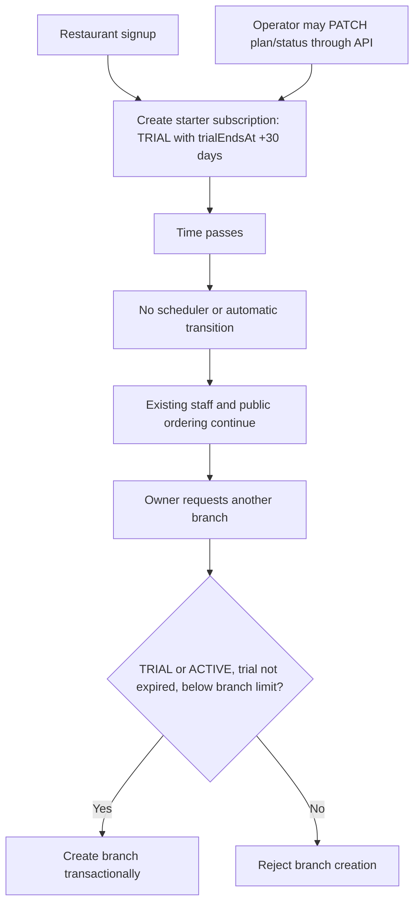
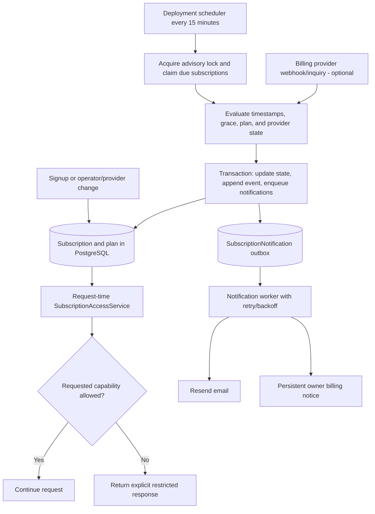

# Subscription lifecycle, scheduling, and notifications

This guide explains how subscription state, scheduling, access policy, and owner notifications work in the current Orderly codebase and how to evolve them into a production billing lifecycle. It is separated from the main architecture reference so the current system map remains concise.

See the [system architecture reference](ARCHITECTURE.md) for the wider domain model, service boundaries, security controls, and deployment topology.

The current subscription feature is a small entitlement representation rather than a billing system. It records a tenant's plan and status and enforces the plan's active-branch limit when another branch is created. It does not collect money, generate invoices, renew periods, run scheduled lifecycle transitions, or notify owners about trial or billing events.

## Current persisted model

`Plan` currently contains:

- a stable string ID
- display name
- `branchLimit`
- active state and creation time

The multi-tenant migration creates two plan definitions:

- `starter`: one active branch
- `standard`: two active branches

Prices are intentionally absent. The suggested ฿490/฿790 business assumptions are not application logic.

Each tenant can have one `Subscription` because `tenantId` is unique. It stores:

- `planId`
- `status`: `TRIAL`, `ACTIVE`, `PAST_DUE`, or `CANCELLED`
- optional `trialEndsAt`
- optional `currentPeriodEndsAt`
- creation and update timestamps

There is no provider customer ID, provider subscription ID, billing email, price/currency snapshot, invoice, payment attempt, grace deadline, cancellation schedule, status history, or notification record.

## What happens at signup

Restaurant signup transactionally creates:

1. the owner when needed
2. a tenant
3. a `starter` subscription with `status = TRIAL`
4. `trialEndsAt = signup time + 30 × 24 hours`
5. the initial branch, settings, menu, and owner membership

The calculation is an exact 30-day duration from the server clock. It is not rounded to midnight in the branch timezone. Migrated legacy POC data receives an `ACTIVE` standard subscription without trial or current-period dates.

## Current enforcement behavior

Subscription enforcement occurs only in `POST /api/restaurant/branches`:

1. The owner-only endpoint locks the tenant row inside a database transaction.
2. It loads the subscription and plan.
3. It permits only `TRIAL` or `ACTIVE`.
4. For `TRIAL`, it rejects the request when `trialEndsAt` is in the past.
5. It counts active branches and rejects creation when the count reaches `plan.branchLimit`.
6. It creates the branch, settings, menu, and owner membership in the same transaction.

The tenant lock serializes concurrent branch creation, so two simultaneous requests cannot both pass the branch limit.

No other current authorization path evaluates the subscription:

- `AuthGuard` validates the login session and active user.
- `MemberGuard` validates membership plus active tenant and branch.
- Public QR resolution validates active tenant, branch, service point/session, and QR mode.
- Menu management, staff operations, public order creation, reports, and existing branch use do not inspect subscription status or dates.

As a result, an expired trial, `PAST_DUE` subscription, or `CANCELLED` subscription continues operating on existing branches. It can still accept public orders and staff can continue normal work. The subscription prevents creating another branch but is not currently a service suspension mechanism. This behavior avoids accidentally interrupting a restaurant, but it is implicit rather than an explicit grace/access policy.

Changing from standard to starter while two branches are active does not deactivate either branch. It prevents further branch creation because the active count is already at or above the new limit.

`currentPeriodEndsAt` is not written or read anywhere in the current application. An `ACTIVE` subscription therefore remains active indefinitely until a platform operator changes its status manually.

## Current operator interface

`GET /api/platform/tenants` is protected by `OperatorGuard` and returns at most 100 newest tenants with:

- tenant identity and status
- creation date
- total branch count
- subscription status and trial end
- plan ID, name, and branch limit

`PATCH /api/platform/tenants/:id/subscription` allows an operator to change the plan between `starter` and `standard` and set any current subscription status. The endpoint does not update trial/current-period dates, validate a transition graph, record a reason, store the operator as an actor, or create an audit event.

The `/platform` page is currently read-only. It shows tenant, branch count, plan name, and status. It does not display trial expiry, provide status/plan controls, or call the subscription PATCH endpoint. The shared API client also exposes only the list operation, so manual changes require a direct authenticated API call or database administration.

Restaurant owners see the plan name, status, and branch limit through the branch response, and the branch-management page says that the subscription controls active branches. The normal owner UI does not show `trialEndsAt`, days remaining, renewal state, a billing portal, or a payment action.

## Current scheduling and notifications

There is no subscription scheduler.

- The NestJS application does not import `ScheduleModule` or define cron jobs.
- The production Compose stack contains PostgreSQL, migration, API, web, and proxy services only; there is no worker or scheduler service.
- No host-cron command or GitHub scheduled workflow advances subscriptions.
- An expired trial remains stored as `TRIAL` with a past timestamp.
- `currentPeriodEndsAt` does not trigger renewal, cancellation, or `PAST_DUE`.
- There is no reconciliation process for subscription state.

There are also no subscription notifications. `EmailService` currently sends password-reset, password-change, and staff-invitation email through Resend. No code sends trial reminders, expiry notices, payment-failure notices, renewal confirmations, cancellation notices, or operator alerts. There is no persistent in-app notification or delivery/outbox table.

## Problems to resolve before automatic billing

The current representation is safe for a POC but leaves several product decisions undefined:

- An expired trial and a cancelled subscription do not have an explicit access policy.
- Owners cannot see or act on upcoming expiry.
- Operators cannot manage subscriptions from the UI or audit who changed them.
- `currentPeriodEndsAt` has no meaning in runtime behavior.
- Plan downgrade overage is visible only when another branch is created.
- There is no billing contact distinct from staff accounts.
- Email failure, duplicate reminders, and retry behavior are undefined.
- A future billing webhook could arrive late, twice, or out of order, but there is no event ledger.
- There is no invoice/payment representation or link between money received and a subscription period.
- Tenant `SUSPENDED` and subscription restriction are not distinguished operationally. Tenant suspension currently blocks staff and public QR access and should remain reserved for security, abuse, or operator intervention rather than ordinary payment delay.

## Recommended separation of concerns

Treat four concepts separately:

1. **Plan definition:** commercial name, active state, branch limit, feature entitlements, and a reference to pricing rather than hard-coded UI prices.
2. **Billing state:** trial, active billing period, past due, cancellation, provider IDs, invoices, and money collection.
3. **Access policy:** the effective capabilities allowed right now, derived from billing state, timestamps, grace policy, tenant status, and plan entitlements.
4. **Notification delivery:** durable in-app/email messages generated from lifecycle events, independent of whether access checks succeed.

Centralize access evaluation in a service such as `SubscriptionAccessService`. It should return an effective state and entitlements for a tenant, for example:

- `FULL`: normal use
- `GRACE`: normal restaurant operation with prominent owner warnings; expansion may be blocked
- `RESTRICTED`: no new public orders, sessions, branches, invitations, or menu changes, while staff can finish active orders, process refunds, view history, and export data
- `BLOCKED`: tenant suspension for security/abuse; current behavior may deny all tenant access

The exact commercial policy remains a product decision, but restaurant operations should not stop at an arbitrary instant without warning. A practical default is:

- `TRIAL` before `trialEndsAt`: `FULL`
- expired trial: `RESTRICTED` after scheduled warnings, or a short explicit grace period
- `ACTIVE` before `currentPeriodEndsAt`: `FULL`
- `PAST_DUE` before `graceEndsAt`: `GRACE`
- `PAST_DUE` after grace: `RESTRICTED`
- cancellation scheduled for period end: `FULL` until `accessUntil`
- cancelled after access ends: `RESTRICTED`
- tenant `SUSPENDED`: `BLOCKED` independently of subscription

Apply effective access at request time. A scheduler must not be the only enforcement mechanism: if the scheduler is down when a trial expires, the next protected write must still calculate the correct access from persisted timestamps. The scheduler materializes transitions, sends notifications, and performs reconciliation; request-time policy protects correctness.

Use different capabilities instead of one global subscription guard. For example, `CREATE_ORDER`, `START_SESSION`, `MANAGE_MENU`, `INVITE_STAFF`, `CREATE_BRANCH`, `FULFILL_EXISTING_ORDER`, `PROCESS_REFUND`, and `EXPORT_DATA` can map to the access mode. This keeps a payment issue from stranding already accepted restaurant orders.

When a public branch becomes restricted, menu/status pages should return a clear temporary-unavailability response and existing order-status links should continue working. Staff should see the reason and recovery action. Never silently accept and discard an order.

## Recommended scheduler

For the present single-server deployment, use one durable command such as `npm run subscriptions:tick` invoked every 15 minutes by the deployment platform or a small Compose worker. Keep scheduling outside browser requests. Do not add Redis or a general queue solely for this feature.

The command should:

1. Acquire a PostgreSQL advisory lock so only one scheduler instance runs at a time.
2. Select due subscriptions in bounded batches using indexed timestamps.
3. Lock each selected subscription before evaluating it.
4. Recalculate effective lifecycle state from database time.
5. Write a `SubscriptionEvent` only for a real transition or due milestone.
6. Create notification outbox rows in the same transaction.
7. Commit before any email/network call.
8. Continue safely after one tenant fails.
9. Record run counts, duration, failures, and next due time.

At the current scale, a scan of due indexed records is sufficient. If volume grows, store `nextActionAt` on the subscription or create explicit `SubscriptionTask` rows and claim them with `FOR UPDATE SKIP LOCKED`. Every operation must be idempotent because schedulers can overlap or rerun after a crash.

Recommended time-based milestones are configurable rather than embedded throughout controllers. A simple starting policy is:

- trial started
- 7 days before trial end
- 3 days before trial end
- 1 day before trial end
- trial expired
- payment failed / subscription became past due
- grace period halfway point
- 1 day before grace ends
- access restricted
- payment recovered / access restored
- plan changed
- cancellation scheduled
- cancellation effective

Store lifecycle timestamps in UTC. Render dates in a configured tenant billing timezone; branch timezones may differ and should not determine one tenant-wide billing boundary.

## Recommended notification delivery

Use a transactional outbox in PostgreSQL rather than sending email inside the subscription update transaction.

Suggested `SubscriptionNotification` fields include:

- tenant and subscription IDs
- lifecycle event ID
- milestone/template key
- channel such as `IN_APP` or `EMAIL`
- recipient identity/address snapshot
- `PENDING`, `SENDING`, `SENT`, `FAILED`, or `CANCELLED`
- attempt count, `nextAttemptAt`, last error category, provider message ID, sent time, and creation time

Add a unique key across subscription, lifecycle occurrence, milestone, channel, and recipient. This prevents duplicate email when the scheduler reruns. A notification worker should claim due rows, send through `EmailService`, and retry transient failures with bounded exponential backoff. Permanent address/provider errors should remain visible to operators instead of retrying forever.

Email failure must never roll back a subscription transition or change the access policy. The owner UI should also show persistent billing banners/notices, so access information is available when email is delayed or unavailable.

Choose one tenant billing contact and optionally notify all active owners. Deduplicate shared addresses and store the intended recipient snapshot with the event. Staff should not receive billing email by default. Public customers should never receive tenant subscription messages.

## Suggested model extensions

Extend `Subscription` with the minimum fields required by the chosen policy:

- billing mode: `MANUAL` or provider identifier
- billing contact/user or email
- provider customer and subscription IDs when applicable
- `currentPeriodStartsAt`, `currentPeriodEndsAt`
- `graceEndsAt`
- `cancelAtPeriodEnd`, `cancelAt`, `cancelledAt`
- `accessUntil` when commercial access differs from provider status
- `nextActionAt`
- provider state version/event time for ordering updates

Add an append-only `SubscriptionEvent` containing tenant, subscription, previous/next state, effective time, source (`SIGNUP`, `SCHEDULER`, `OPERATOR`, or `PROVIDER`), external event ID, actor when applicable, reason, and creation time.

Add `SubscriptionNotification` as the durable outbox/delivery record. If automatic billing is selected later, add invoice and billing-payment records rather than reusing restaurant `Order` or `Payment` concepts; restaurant sales and SaaS subscription billing are separate domains.

Keep plan prices out of controller conditionals. A `PlanPrice` or provider price mapping can store currency, billing interval, amount in minor units, provider price ID, effective dates, and active state. Snapshot the applied plan/price on each billing period or invoice so historical billing does not change when pricing changes.

Useful indexes begin with due/state fields used by the scheduler, for example `(status, nextActionAt)` and `(status, trialEndsAt)`, while tenant-unique provider IDs and notification idempotency keys prevent cross-tenant ambiguity and duplicate work.

## Manual billing without an external billing provider

The improved scheduler and notifications do not require automatic billing. A simple operator-managed release can:

1. Add operator UI controls for plan, status, trial end, current period end, grace end, and a required reason.
2. Record every operator change as a `SubscriptionEvent`.
3. Store an external invoice/reference and optional paid date without pretending Orderly transferred money.
4. Let the scheduler send upcoming-expiry and past-due reminders.
5. Let the operator mark payment received and extend `currentPeriodEndsAt`.
6. Use centralized access policy for expiry and grace.
7. Show owners the current plan, limits, dates, notices, and contact/support action.

This supports bank transfer/manual invoicing while keeping lifecycle behavior deterministic. Operator changes should use optimistic concurrency or a row lock so a manual update cannot overwrite a scheduler transition.

## Automatic billing provider extension

When a billing provider is chosen, treat signed provider webhooks as billing inputs and PostgreSQL as the application source of truth:

1. Create checkout/customer/subscription requests server-side with tenant-scoped idempotency keys.
2. Store provider customer, subscription, price, invoice, and event identifiers with unique constraints.
3. Preserve and verify the raw webhook body according to the provider's signature scheme.
4. Durably record each provider event before processing it.
5. Reject invalid signatures and unknown merchant/account context.
6. Apply events idempotently and ignore stale out-of-order events using provider sequence/version/effective time.
7. Translate provider status into the internal billing state in one transaction, write a `SubscriptionEvent`, and enqueue notifications.
8. Periodically reconcile subscriptions and invoices through the provider API because webhooks can be delayed or missed.
9. Keep test/live credentials, endpoints, events, and subscriptions separated.

The provider should not call restaurant order APIs, and subscription webhooks should not reuse PromptPay order-payment records. A provider outage should delay billing reconciliation and notifications without corrupting restaurant orders.

## Target scheduling and notification structure

## Failure and recovery rules

- If the scheduler misses a run, request-time effective access still uses timestamps; the next run catches up lifecycle events and pending milestones.
- If two scheduler instances overlap, the advisory lock and notification uniqueness keys prevent duplicate transitions/messages.
- If the process crashes after the database commit but before email, the outbox remains `PENDING` and a later worker retries it.
- If email is unavailable, owner banners and operator views still show the current state; access does not depend on delivery.
- If a provider webhook is duplicated, the provider event unique key returns the already processed result.
- If webhooks arrive out of order, older provider versions/effective times cannot overwrite newer state.
- If a plan downgrade creates branch overage, do not deactivate branches automatically. Block expansion, show the overage, and require the owner/operator to choose which branch to deactivate or restore the higher plan.
- If access becomes restricted while orders are active, allow fulfillment, payment confirmation, refunds, history, and export for existing records. Reject new orders/sessions clearly.
- If a cancellation is reversed or payment recovers, restore access through a recorded transition and send one recovery notification.

## Recommended implementation sequence

1. Decide the trial-expiry, past-due grace, cancellation, and restricted-capability policy.
2. Add subscription dates, billing contact, `SubscriptionEvent`, and notification outbox migrations.
3. Add operator controls and owner subscription/billing status UI.
4. Implement centralized request-time `SubscriptionAccessService` and apply it first to expansion and new-order capabilities.
5. Add the idempotent scheduler command and notification worker using PostgreSQL.
6. Configure the deployment scheduler and monitoring; test scheduler downtime and catch-up.
7. Add manual renewal/invoice references if manual billing is the first commercial release.
8. Integrate one billing provider only after the internal lifecycle and notification behavior works end to end.

Prioritize tests for exact trial/period/grace boundaries, duplicate scheduler runs, retry after email failure, notification uniqueness, operator-versus-scheduler races, branch-limit concurrency, plan downgrade overage, provider event ordering, tenant isolation, and continued handling of active restaurant orders during restriction.
